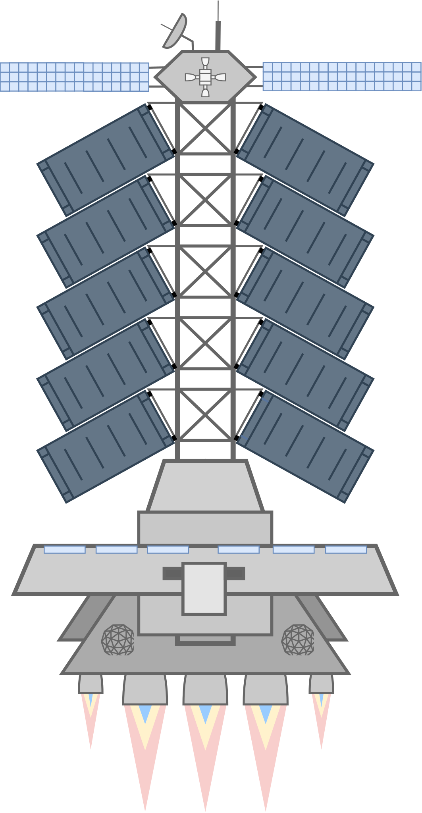
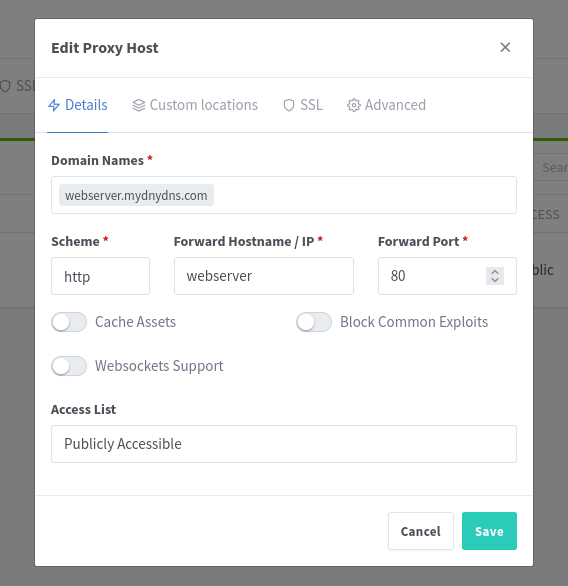

# SwarmPilot

<p align="center">
  
</p>

<p align="center"><b>Deploy your Swarm cluster with one script — automatically
</b></p>

SwarmPilot helps you to deploy a high available docker swarm cluster from 1 to 9 nodes with the following components:

## Components

### [Docker](https://www.docker.com)
Docker is a technology that bundles a software program with all the other software that application needs to run, such as an operating system, third-party software libraries, etc. Software bundled like this is called a container.

### [Keepalived](https://keepalived.org/)
Used for managing a virtual IP address for all cluster nodes

### [Syncthing4Swarm](https://github.com/SuitDeer/syncthing4swarm/tree/main)
Ensures persistent volume synchronization

### [Portainer](https://www.portainer.io/)
It provides an intuitive graphical user interface and extensive API for managing resources such as containers, images, and networks via a Web interface 9443 (HTTPS)

### [Nginx Proxy Manager](https://nginxproxymanager.com/)
Used for a central reverse proxy and SSL termination for other docker services on this cluster. Web interface at 81 (HTTP)

## Topology


## Requirements

- Ubuntu Server installed on all nodes
- SSH access on all nodes
- Root access on all nodes
- Additional unused IP address for keepalived (virtual IP of the docker swarm cluster)
- `sshpass` must be installed on all nodes: `sudo apt install sshpass`

## Quick Start

Run only on **one node**:

```bash
# Clone the repository
git clone https://github.com/SuitDeer/SwarmPilot.git
cd SwarmPilot

# Deploy to Swarm
sudo chmod +x swarmpilot.sh
sudo ./swarmpilot.sh
```

## Setup Video

<!-- Embedding a GitHub Release video with HTML5 -->
<video controls>
  <source src="https://raw.githubusercontent.com/SuitDeer/SwarmPilot/refs/heads/main/pictures/setup-demo-video.mp4" type="video/mp4">
  Your browser does not support the video tag.  
</video>

https://github.com/user-attachments/assets/4bd35877-4b11-4a83-b456-ab66db2a5267

## Setup a demo stack on cluster

Please use the `nginx_ingress` overlay network for your stacks if you need ssl termination via Nginx Proxy Manager.

Example:

If your stack containers need persistent volumes please first create the root directory in the syced syncthind directory:

```bash
sudo mkdir /var/syncthing/data/<FOLDER_NAME>
```

```yaml
services:
  webserver:
    image: nginxdemos/hello
    volumes:
     - /var/syncthing/data/<FOLDER_NAME>:/var/www/html
    networks:
      - nginx_ingress
    ports:
      - 8082:80
networks:
  nginx_ingress:
    external: true
```

Because the Nginx Proxy Manager-container and the your new docker stack containers now connected to the same overlay network `nginx_ingress` you can reference your containers in Nginx Proxy Manager via their servicenames.

```
services:
  webserver: <---- This is the service-name of the container
...............
```



## Maintanance

### Upgrade Syncthing4Swarm Stack

```bash
cd SwarmPilot
sudo docker stack deploy --resolve-image=always -c syncthing4swarm.yaml syncthing4swarm
```

### Upgrade Portainer Stack

```bash
cd SwarmPilot
sudo docker stack deploy --resolve-image=always -c portainer.yaml portainer
```

### Upgrade Nginx Proxy Manager Stack

```bash
cd SwarmPilot
sudo docker stack deploy --resolve-image=always -c nginxproxymanager.yaml nginxproxymanager
```

---
---

## Detailed Script Workflow Steps

The [`swarmpilot.sh`](swarmpilot.sh) script automates the entire cluster setup process through the following steps:

### Step 1: User Input Collection
- **Local Node IP**: The IP address of the node running the script
- **Node Count**: Number of nodes in the cluster (1-9, including the local node)
- **Remote Node Information**: For each remote node, the script collects:
  - IP address
  - Username
  - Password (validated for length 8-128 characters)

### Step 2: Pre-flight Checks
- Verifies `sshpass` is installed on the local node
- Checks `sshpass` installation on all remote nodes
- Ensures SSH connectivity to all nodes

### Step 3: Docker Installation
- Updates package lists
- Installs required dependencies (ca-certificates, curl)
- Adds Docker GPG key and repository
- Installs Docker Engine, CLI, containerd.io, and Docker plugins
- Enables and starts Docker service
- Validates installation with hello-world test

### Step 4: Docker Swarm Initialization
- Initializes Docker Swarm on the local node with the specified advertise address
- Retrieves the manager join token
- Joins all remote nodes to the swarm using the join token

### Step 5: Keepalived Configuration (for clusters > 1 node)
- Prompts for virtual IP address for the cluster
- Calculates priorities for each node (local node: 255, remote nodes: 254, 253, etc.)
- Installs and configures keepalived on all nodes:
  - Detects network interface automatically
  - Creates keepalived configuration with unicast peers
  - Sets state (MASTER for local node, BACKUP for remote nodes)
  - Enables and starts keepalived service
- Configures automatic failover between nodes

### Step 6: Syncthing4Swarm Installation
- Creates `/var/syncthing/data` directory on all nodes
- Creates syncthing4swarm.yaml configuration file
- Deploys Syncthing4Swarm Docker stack
- Installs Syncthing4Swarm on all remote nodes
- Monitors container health until all containers are healthy

### Step 7: Portainer Installation
- Creates portainer data directory
- Creates portainer.yaml configuration file
- Deploys Portainer stack
- Exposes Portainer on ports 9443 (HTTPS) and 8000 (HTTP)
- Verifies Portainer accessibility

### Step 8: Nginx Proxy Manager Installation
- Creates data directories for Nginx Proxy Manager
- Creates nginxproxymanager.yaml configuration file with:
- Deploys Nginx Proxy Manager stack
- Exposes on ports 80 (HTTP), 81 (Web UI), and 443 (HTTPS)
- Verifies Nginx Proxy Manager accessibility
